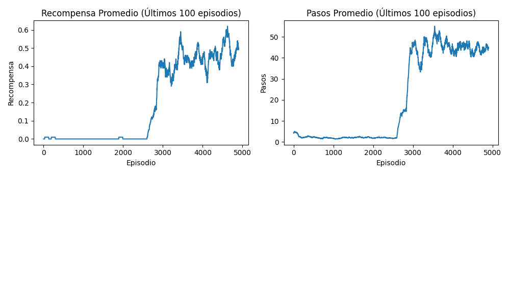

# **Exámen Corto 1 - Inteligencia Artificial

- [Mónica Salvatierra - 22249](https://github.com/alee2602)
- [Paula Barillas - 22764](https://github.com/paulabaal12)
- [Derek Arreaga - 22537](https://github.com/FabianKel)

#####  LINK DE REPOSITORIO
https://github.com/FabianKel/EC1-IA

#### LINK DE VIDEO DE DEMOSTRACIÓN
https://youtu.be/mfNdHp1tWlo

## Introducción
Este exámen corto consiste en la implementación de un agente inteligente que resuelva el juego de Frozen Lake
con el argumento de slippery=True, usando un algoritmo de aprendizaje por refuerzo.

## **Ejecución del Programa**
Para ejecutar el código, asegúrate de tener **Python 3** instalado y las librerías de **requirements.txt**:

```bash
pip install -r requirements.txt
```

Luego, ejecuta el script principal:

```bash
python main.py
```

## **Ejemplo de Salida**
1. .Tras ejectutar el programa, primero se

2. Luego inicia la simulación donde se pone a prueba lo aprendido por el agente:

<center>


</center>

3. Al finalizar la ejecución, en la terminal se mostrará la Tasa de éxito del agente en el escenario generado, al igual que el promedio de pasos que le tomó en cada intento.

    ```python
    Resultados finales:
    Tasa de éxito: 60.00%
    Pasos promedio: 30.40
    ```
4. Acto seguido, se generarán las siguientes métricas y diagramas describiendo el proceso del agente.
    * Mapa generado ([generated_map.png](generated_map.png))
    
    

    * Métricas de Aprendizaje ([learning_metrics.png](learning_metrics.png))

    

    * Política Aprendida ([policy_map.png](policy_map.png))
    
    